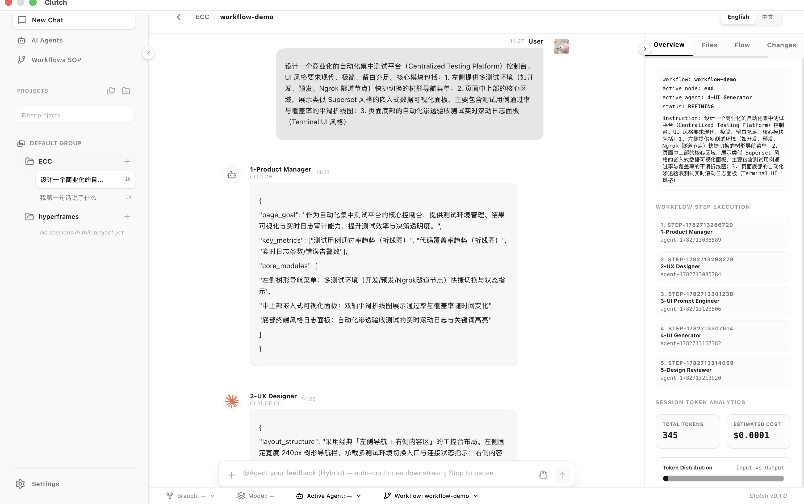
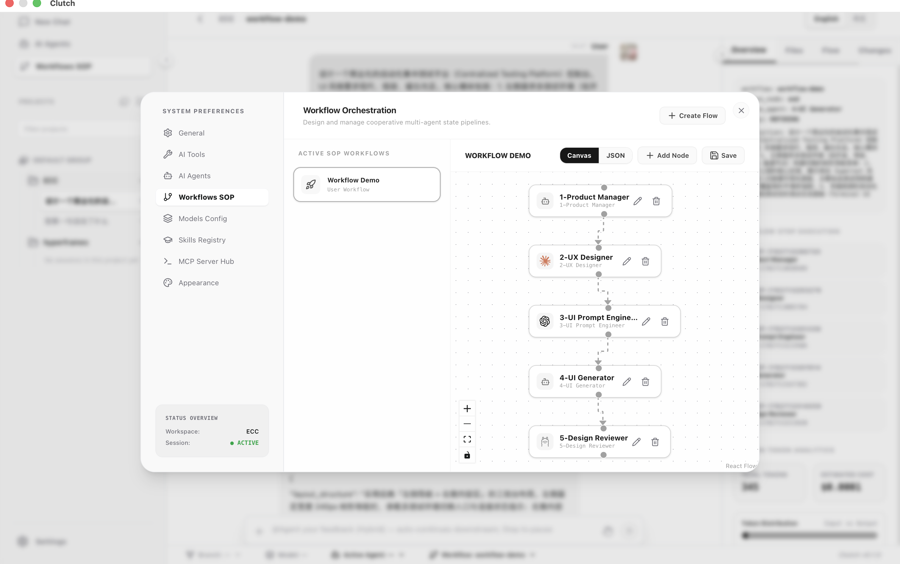

# Clutch

本地 AI 多 Agent 编排与监督控制台（Tauri 桌面应用 + Python Sidecar）。

## 这是什么

**Clutch** 面向独立开发者与技术运营人员，解决「单 Agent 对话上下文膨胀」和「多 Agent 协作过程黑盒、流程难改」两类工程痛点。它不是替代 Claude Code / Cursor 的生成能力，而是在本地加一层**可持久化、可观测、可编辑**的流程控制层：你在画布上零代码拖拽 SOP，系统用 LangGraph 调度本地 CLI、MCP 与大模型，并在统一工作台里全程监督执行与人工审批。

**技术栈：** Tauri 2 · React 19 · FastAPI + LangGraph · 本地优先（Sidecar `localhost:8123`）

### 主要功能（概览）

| 能力 | 说明 |
|------|------|
| **可视化工作流编排** | React Flow 画布定义多 Agent SOP，编译为 LangGraph 状态机运行 |
| **本地 AI 工具接入** | 扫描并连接 Claude Code、Codex、Ollama、Aider 等本地 CLI |
| **统一监督控制台** | Chat 流、终端日志、文件树、代码 Diff、流程进度一屏可见 |
| **人机协同门控** | 高风险操作或检查失败时挂起，支持批准 / 打回 / 重试 |
| **智能体与模型配置** | Agent Manager、模型 API Key、Skills 注册表、MCP 服务网关 |
| **Hybrid 会话** | 多 Session 并行、工作流精修与自动续跑、状态跨会话恢复 |

> **想了解全部功能、架构细节与运行机制？** 请阅读 **[`docs/PRODUCT_INTRO.md`](./docs/PRODUCT_INTRO.md)**（产品介绍权威文档，含痛点分析、页面功能清单与数据流说明）。开发者架构叙事见 [`docs/ARCHITECTURE.md`](./docs/ARCHITECTURE.md)。

## 产品截图

**Hybrid 工作流监督台** — 多 Agent 协作、流程进度与 Token 统计一屏可见：



**可视化 SOP 编排** — 在画布上零代码拖拽多 Agent 流水线：



## 仓库结构

> 与磁盘一致（排除 `node_modules`、`.venv`、`dist` 等构建产物）。治理层五层标注见 [`docs/document-governance.md`](./docs/document-governance.md)。

```
clutch/
├── CLAUDE.md                       # Layer 1 — 治理规则唯一权威
├── AGENTS.md                       # 多 AI 工具索引（指针）
├── UI_UX_GUIDELINES.md
├── package.json
├── pnpm-workspace.yaml
├── .env.example
├── src/                            # Pro 空壳占位（第 7 步起）
├── scripts/
│   ├── verify.sh                   # 本地一键校验（build + pytest + drift）
│   ├── tauri-dev.sh                # Tauri 开发：守护化 Vite + tauri dev
│   ├── doctor.sh                   # 环境自检（Node / uv / 平台）
│   └── check-doc-drift.sh          # 文档↔代码机检不变量（D7）
├── .husky/
│   └── pre-commit                  # 条件触发 verify / drift（D7）
├── specs/
│   └── core/
│       ├── proposal.md             # Layer 2 — 产品需求历史快照
│       ├── design.md               # Layer 2 — 视觉设计快照（→ UI_UX_GUIDELINES）
│       └── tasks.md                # Layer 2 — M0–M4 开发任务清单
├── memory/                         # Layer 3 — Agent 跨会话运行态
│   ├── PROGRESS.md
│   ├── FAILURES.md
│   ├── FILEMAP.md                  # 文件路径速查（≠ docs/ARCHITECTURE.md）
│   ├── DECISIONS.md
│   ├── ROADMAP.md
│   └── TESTS.md
├── .claude/workflows/              # Layer 4 — 可选自动化
├── .cursor/rules/
│   └── base.mdc                    # Cursor 指针 → CLAUDE.md
├── .github/
│   ├── workflows/
│   │   └── ci.yml                  # CI：pnpm build + pytest
│   └── copilot-instructions.md     # Copilot 指针 → CLAUDE.md
├── runs/                           # Layer 5 — 执行证据
│   └── verification/               # 测试/覆盖率报告归档（gitignore）
├── apps/
│   └── desktop/                    # Tauri + React 桌面端
│       ├── src/
│       └── src-tauri/
├── services/
│   └── orchestrator/               # Python Sidecar（LangGraph）
│       ├── src/
│       └── tests/
├── packages/
│   └── shared-types/
├── workflows/                      # Workflow JSON Schema + 模板
├── e2e/                            # （D1，M2 后可执行）Playwright 全链路 E2E
└── docs/
    ├── ARCHITECTURE.md             # 系统架构详述（叙事 + ADR）
    └── document-governance.md      # 五层架构与权威优先级
```

**解耦原则**：`apps/desktop` 与 `services/orchestrator` 仅通过 `localhost:8123` HTTP/WebSocket 通信。

## 文档地图

| 文件 | 用途 |
|------|------|
| [`README.md`](./README.md) | 本页：项目简介、结构、快速开始、文档索引 |
| [`docs/PRODUCT_INTRO.md`](./docs/PRODUCT_INTRO.md) | **产品介绍（推荐首读）**：定位、痛点、全量功能与运行机制 |
| [`CLAUDE.md`](./CLAUDE.md) | **唯一权威**：铁律、命令、Check-in、日志规范 |
| [`AGENTS.md`](./AGENTS.md) | 多 AI 工具入口索引 |
| [`memory/PROGRESS.md`](./memory/PROGRESS.md) | Agent 进度接力棒 |
| [`memory/FILEMAP.md`](./memory/FILEMAP.md) | 文件路径速查（Check-in 用） |
| [`docs/ARCHITECTURE.md`](./docs/ARCHITECTURE.md) | 系统架构详述（设计理由、数据流） |
| [`docs/OPEN_SOURCE_RELEASE.md`](./docs/OPEN_SOURCE_RELEASE.md) | 开源、安全、分发与 OSR 排期 |
| [`docs/PROJECT_SCOPE.md`](./docs/PROJECT_SCOPE.md) | Goals / Non-Goals |
| [`docs/STABILITY.md`](./docs/STABILITY.md) | API / Schema 稳定性 |
| [`docs/BUILD_FROM_SOURCE.md`](./docs/BUILD_FROM_SOURCE.md) | 源码克隆、开发启动、`pnpm tauri build` |
| [`LICENSE`](./LICENSE) | MIT 开源协议 |
| [`CHANGELOG.md`](./CHANGELOG.md) | 版本变更（当前 **1.0.0**） |
| [`SECURITY.md`](./SECURITY.md) | 漏洞私密报告渠道与响应约定 |
| [`CODE_OF_CONDUCT.md`](./CODE_OF_CONDUCT.md) | 社区行为准则 |
| [`CONTRIBUTING.md`](./CONTRIBUTING.md) | **如何贡献**、Phase 1 PR 政策 |
| [`docs/GOVERNANCE.md`](./docs/GOVERNANCE.md) | 维护者治理 |
| [`docs/PERFORMANCE.md`](./docs/PERFORMANCE.md) | 性能基线 |
| [`docs/document-governance.md`](./docs/document-governance.md) | 五层架构与权威优先级 |
| [`specs/core/proposal.md`](./specs/core/proposal.md) | 产品需求历史快照（非权威） |
| [`specs/core/tasks.md`](./specs/core/tasks.md) | M0–M4 开发任务清单 |
| [`specs/core/design.md`](./specs/core/design.md) | 视觉设计快照 |
| [`UI_UX_GUIDELINES.md`](./UI_UX_GUIDELINES.md) | 前端 React + Tailwind UI/UX |

## 兼容性

> 详细稳定性见 [`docs/STABILITY.md`](./docs/STABILITY.md)。**0.x 版本可能随时 breaking change。**

### 平台

| 项 | 支持级别 |
|----|----------|
| macOS 14+（Apple Silicon） | ✅ 官方主要目标 |
| macOS 14+（Intel） | ⚠️ 尽力支持，未充分测试 |
| macOS 13 及更早 | ⚠️ 不保证 |
| Windows | 🚧 架构预留，无官方安装包 |
| Linux | 🚧 无官方安装包 |

### 开发工具链（源码构建）

| 组件 | 版本要求 |
|------|----------|
| Node.js | **≥ 20**（推荐 22 LTS） |
| pnpm | **≥ 9**（仓库锁定 `9.15.0`） |
| Python | **≥ 3.11**（CI 使用 3.11） |
| [uv](https://docs.astral.sh/uv/) | 最新稳定版 |
| Rust | 最新 stable（仅 `pnpm tauri build` 时需要） |

环境自检：

```bash
./scripts/doctor.sh
```

## 快速开始

**前置**：Node 20+、pnpm 9+、Python 3.11+、[uv](https://docs.astral.sh/uv/)、Rust（Tauri 打包时）

```bash
pnpm install
```

启动与校验命令见 [`CLAUDE.md`](./CLAUDE.md) §核心命令。

## 安装方式

### 从 Release 安装（终端用户 · macOS）

从 [GitHub Releases](https://github.com/fancy1108/Clutch/releases) 下载 **macOS `.dmg`**（当前为**未签名**构建，与多数开源桌面项目相同；见 [`memory/DECISIONS.md`](./memory/DECISIONS.md) **D31**）：

1. 下载对应架构的 DMG（Apple Silicon 选 `aarch64`）并拖入 **Applications**
2. **首次打开**若被 Gatekeeper 拦截，任选其一：
   - **Finder** 中右键 **Clutch.app** → **打开** → 确认打开
   - 或终端：`xattr -cr /Applications/Clutch.app` 后从启动台打开
3. 约 5s 内侧车应就绪：`curl -s http://127.0.0.1:8123/health` → `{"status":"ok"}`

维护者发版：打 tag `v1.0.0`（或后续 `v1.x.x`）触发 [`.github/workflows/release.yml`](./.github/workflows/release.yml) 自动构建并上传 DMG；或本机 `cd apps/desktop && pnpm tauri build` 后手动上传到 Release。

完整安装与隐私说明见 [`docs/INSTALL.md`](./docs/INSTALL.md)（T2 / OSR-15，随发版补齐）。Apple 代码签名与公证（OSR-11）在获得 Developer 账号前**不阻塞**开源分发。

### 从源码构建（开发者）

```bash
git clone https://github.com/fancy1108/Clutch.git
cd Clutch
./scripts/doctor.sh
pnpm install
cd services/orchestrator && uv sync --extra dev && cd ../..
export CLUTCH_RUNTIME_MODE=hybrid   # 可选
pnpm tauri:dev
```

逐步说明、分拆调试与本地打 DMG：[`docs/BUILD_FROM_SOURCE.md`](./docs/BUILD_FROM_SOURCE.md)。

**贡献前**请阅读 [`CONTRIBUTING.md`](./CONTRIBUTING.md) 并运行 `./scripts/verify.sh`。

## 安全与 CLI 权限（重要）

Clutch 通过本地 Sidecar（`127.0.0.1:8123` / 开发 `8124`）调度外部 AI CLI。请在使用前了解以下**当前版本**行为：

### CLI 默认跳过内置确认（`--dangerously-skip-permissions`）

对 **Claude Code CLI**（`claude-cli`）与 **Antigravity CLI**（`agy-cli`）等已接入的引擎，Clutch **默认**在调用时追加 `--dangerously-skip-permissions`。这会**绕过**对应 CLI 自身的工具/写入确认提示，以便工作流与 Hybrid 会话自动跑通。

| 含义 | 说明 |
|------|------|
| **适用场景** | 你已信任当前授权工作区，且接受 Agent 在该目录内自动执行工具调用 |
| **风险** | CLI 可在工作区（及 CLI 自身权限可达范围）内改文件、跑命令，**不会**再逐项询问 |
| **UI 中的 Permission 菜单** | 聊天栏旁 `ask` / `auto_edit` / `plan` / `full` 主要作用于 **Clutch 内置 Agent 的 MCP 门控**；**不改变**上述 CLI 的 `skip-permissions` 默认行为 |

**决策记录（OSR-09）：** 维持现状（选项 B），T2 对外分发前在文档中明确披露；后续若改为默认 `ask`，将同步更新本文与 [`SECURITY.md`](./SECURITY.md)。

漏洞报告见 [`SECURITY.md`](./SECURITY.md)。Sidecar 仅监听本机回环地址；发版前加固项见 [`docs/OPEN_SOURCE_RELEASE.md`](./docs/OPEN_SOURCE_RELEASE.md)。
