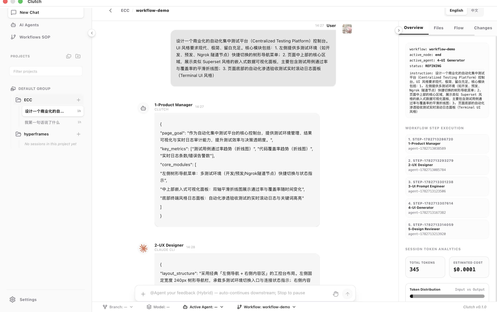
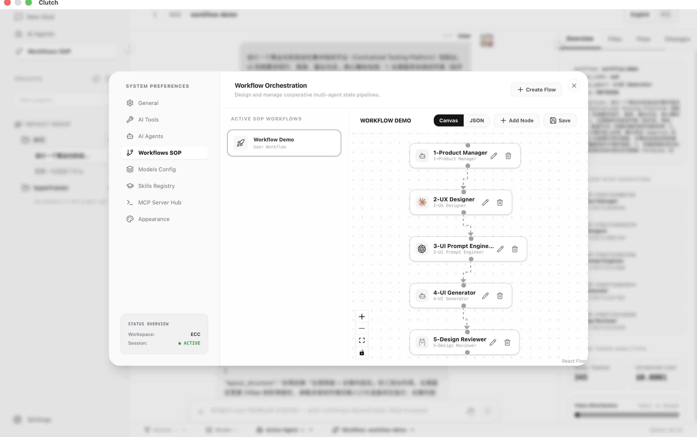
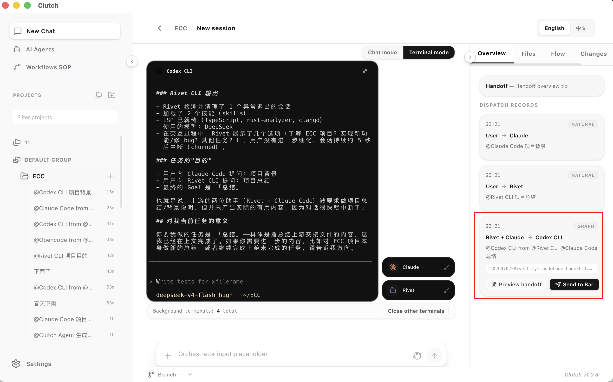

# Clutch

[](https://fancy1108.github.io/Clutch/)

**本地 AI 多 Agent 编排与监督 — 桌面控制台**

[English](README.md) · [简体中文](README.zh-CN.md) · [**产品官网**](https://fancy1108.github.io/Clutch/) · [**新手入门**](docs/GETTING_STARTED.md) · [下载 Releases](https://github.com/fancy1108/Clutch/releases)

> [!TIP]
> **第一次用？** 请先读 **[新手入门指南](docs/GETTING_STARTED.md)** — 安装、首次向导、发出第一条聊天，约 5 分钟，**不需要**配置开发环境。

Clutch 是一款**桌面应用**（Tauri + React），面向独立开发者和技术运营：在 Claude Code、Codex、Ollama、MCP 与云端大模型之上，加一层**看得见、改得了、跑得稳**的多 Agent 流程控制。在画布上拖拽 SOP，LangGraph 在本地执行，你在同一窗口监督聊天、终端、Diff 与人工审批。

**不是**用来替代 Claude Code 或 Cursor 的 — 而是解决**长会话上下文膨胀**和**多 Agent 协作黑盒**的控制层。

| | |
|---|---|
| **技术栈** | Tauri 2 · React 19 · FastAPI + LangGraph · 本地优先（`localhost:8123`） |
| **许可证** | 见 [LICENSE](LICENSE) |
| **当前版本** | [v1.3.0](https://github.com/fancy1108/Clutch/releases/tag/v1.3.0) · [更新日志](CHANGELOG.md#130---2026-07-28) |
| **贡献者** | 感谢 [@MyloveAless](https://github.com/MyloveAless) 设计「AI 图片生成多 Agent 工作流」并完成端到端验证。 |

### 最新更新（v1.3.0）

- **工具轨迹细节（D46）：** 对齐 Cursor / Grok 的工具步骤展示 — 动词分组标题（`Fetched N pages`、`Searched N queries`）、每步显示目标/预览，任意工具步骤支持 **View in Terminal**。
- **权限模式（D27 / D54）：** 输入栏权限按钮改为 **Agent / Plan / Full / Ask**（Cursor 风格的顺序与命名），默认 **Agent**；首次安装向导同步对齐。
- **交付物意图推断（D54）：** Chat 根据你的需求推断交付物类型（页面 / 图片 / 视频 / 代码 / 答复）— 真实的 `generate_image` / `generate_video`，渲染后的 `.html` 自动用系统浏览器打开，散落产物归集到 `.clutch/artifacts/`。
- **工具跳用拦截（D44）：** 实时事实类提问（天气/新闻/URL）若模型只用纯文本作答且零 `tool_calls`，触发一次提醒 + `tool_choice=required` 重试，确保已声明的工具真的被调用。
- **计划批准 → 执行：** 你确认计划后，Chat 注入执行提醒，模型必须 `todo_write` 再改文件，不再反复问确认或仅用文字声称完成。
- **侧栏按最近活动排序：** 项目与会话按最近聊天时间排序，重开旧会话会浮到顶部。

> **v1.3.0 同时发 macOS + Windows。** macOS：Apple Silicon DMG + 应用内更新。Windows：MSI/NSIS。Sidecar 热更资产另行发布。

更早版本（v1.2.9 Coding 发图、v1.2.8 工作流硬化等）：[`CHANGELOG.md`](CHANGELOG.md) · [`docs/releases/`](docs/releases/)。

---

## 快速开始（终端用户）

### 方式 A — 命令行安装（推荐）

**macOS（Apple Silicon）— 二选一：**

```bash
# 一条命令（不需要 Homebrew）
curl -fsSL https://raw.githubusercontent.com/fancy1108/Clutch/main/scripts/install.sh | bash
```

```bash
# 已安装 Homebrew 的用户
brew tap fancy1108/clutch
brew install --cask clutch
```

**Windows（x64 · 尚未在实体机验证）：**

```powershell
irm https://raw.githubusercontent.com/fancy1108/Clutch/main/scripts/install.ps1 | iex
```

指定版本：运行前设置 `CLUTCH_VERSION=v1.3.0`（或 `v1.2.9` / `v1.2.8` / `v1.2.7` / `v1.2.6` 安装更早稳定版）。

详见 [`docs/PACKAGE_MANAGERS.md`](docs/PACKAGE_MANAGERS.md)

### 方式 B — 手动下载

**1. 下载** — [GitHub Releases](https://github.com/fancy1108/Clutch/releases)

| 平台 | 文件 | 状态 |
|------|------|------|
| macOS（Apple Silicon） | `Clutch_*_aarch64.dmg` | ✅ 已验收 |
| Windows 10/11 x64 | `Clutch_*_x64-setup.exe` 或 `.msi` | ⚠️ **尚未在实体机上验证** |

> [!WARNING]
> **Windows：** 安装包由 CI 构建并附在 Release 页，但维护者**尚未在真实 Windows 10/11 实体机上完成完整 smoke 验收**。可能遇到未覆盖的问题，请通过 [Issue](https://github.com/fancy1108/Clutch/issues/new/choose) 反馈（注明系统版本与安装包文件名）。跟踪：[#23](https://github.com/fancy1108/Clutch/issues/23)。

**2. 首次打开（macOS 未签名包）** — 系统可能提示无法验证开发者，开源未签名桌面应用常见现象：

```bash
xattr -cr /Applications/Clutch.app && open -a Clutch
```

或：**应用程序** → 右键 **Clutch** → **打开** → 确认。

**3. 走完设置向导** — 工作区 → 模型或 CLI → 工具 → 完成。

**4. New Chat** — 选 Agent，发一条消息。

→ **图文步骤：** [`docs/GETTING_STARTED.md`](docs/GETTING_STARTED.md) · **安装细节：** [`docs/INSTALL.md`](docs/INSTALL.md)

---

## 能做什么

| 能力 | 一句话 |
|------|--------|
| **可视化工作流** | 画布拖拽多 Agent SOP，编译为 LangGraph 运行 |
| **本地 CLI 接入** | Settings → Tools 连接 Claude Code、CodeBuddy、MiMo Code、ZCode、Codex、Ollama、Aider、Rivet、Grok（`grok-cli`）等 |
| **统一监督台** | 聊天、终端、文件树、Diff、流程进度一屏可见 |
| **人机协同** | 高风险步骤暂停，批准 / 打回 / 带指令重试 |
| **智能体与模型** | 自定义 Agent、API Key、Skills、MCP |
| **Hybrid 会话** | 多 Session、工作流精修、跨重启状态恢复 |

详细介绍：[`docs/PRODUCT_INTRO.md`](docs/PRODUCT_INTRO.md) · 架构：[`docs/ARCHITECTURE.md`](docs/ARCHITECTURE.md)

---

## 产品截图

**Hybrid 工作流监督台** — 多 Agent 运行、进度与 Token 统计：



**可视化 SOP 编排** — 零代码多 Agent 流水线：



**Terminal Orchestra** — Terminal 模式下交互式 CLI 终端、调度与 Session 恢复：



---

## 文档导航

| 我想… | 阅读 |
|-------|------|
| **上手（推荐首读）** | [**`docs/GETTING_STARTED.md`**](docs/GETTING_STARTED.md) |
| 安装 DMG / Windows | [`docs/INSTALL.md`](docs/INSTALL.md) |
| 了解全部功能 | [`docs/PRODUCT_INTRO.md`](docs/PRODUCT_INTRO.md) |
| macOS 应用内更新 | [`docs/UPDATES.md`](docs/UPDATES.md) |
| 从源码构建 | [`docs/BUILD_FROM_SOURCE.md`](docs/BUILD_FROM_SOURCE.md) |
| 参与贡献 | [`CONTRIBUTING.md`](CONTRIBUTING.md)（PR 请提 **`dev`**） |
| macOS / Windows UI 边界 | [`docs/PLATFORM_MAINTENANCE.md`](docs/PLATFORM_MAINTENANCE.md) |
| 安全漏洞报告 | [`SECURITY.md`](SECURITY.md) |

完整索引：[`docs/README.md`](docs/README.md) · **维护者发版：** [`docs/RELEASE_MAINTAINER.md`](docs/RELEASE_MAINTAINER.md)

---

## 兼容性

详见 [`docs/STABILITY.md`](docs/STABILITY.md)

| 平台 | 支持 |
|------|------|
| macOS 14+（Apple Silicon） | ✅ 主要目标 · v1.0.2+ 应用内更新 |
| macOS 14+（Intel） | ❌ **暂不支持** — 仅提供 M 芯片 DMG；Intel 可自行源码编译，不承诺体验 |
| Windows 10/11 x64 | ⚠️ v1.0.2+ 提供安装包 · CI 构建 · **尚未在实体 Windows 机上完整验收** ([#23](https://github.com/fancy1108/Clutch/issues/23)) |
| Linux | 🚧 无官方安装包 |

**开发工具链**（仅源码）：Node ≥ 20、pnpm ≥ 9、Python ≥ 3.11、[uv](https://docs.astral.sh/uv/)、Rust（打包时）。运行 `./scripts/doctor.sh` 自检。

---

## 开发者

```bash
git clone https://github.com/fancy1108/Clutch.git
cd Clutch
./scripts/doctor.sh
pnpm install
cd services/orchestrator && uv sync --extra dev && cd ../..
export CLUTCH_RUNTIME_MODE=hybrid   # 可选
pnpm tauri:dev
```

命令与规范：[`CLAUDE.md`](CLAUDE.md) · 提 PR 前：`./scripts/verify.sh`

---

## 安全与 CLI 权限

Clutch 通过本机回环 Sidecar（`127.0.0.1:8123`）调度本地 AI CLI。

> [!IMPORTANT]
> 对 **Claude Code**、**CodeBuddy**、**MiMo Code**、**ZCode**、**Antigravity (agy)** 等 CLI，Clutch **默认**追加权限绕过参数（`--dangerously-skip-permissions` 或 ZCode 的 `--mode yolo`），以便工作流自动跑通、不再逐项确认。请只在信任的工作区使用。聊天栏 Permission 菜单管的是**内置 Agent 的 MCP 门控**，不改变上述 CLI 默认行为。

漏洞报告：[`SECURITY.md`](SECURITY.md)

---

## 仓库结构

```
clutch/
├── apps/desktop/           # Tauri + React 前端
├── services/orchestrator/  # Python Sidecar（LangGraph）
├── docs/                   # 产品与安装文档
├── workflows/              # 工作流 Schema 与模板
└── scripts/                # verify · doctor · release
```

前端与 Sidecar 仅通过 loopback HTTP/WebSocket 通信（开发 `8124`，打包 `8123`）。

---

## 社区

- **问题反馈：** [GitHub Issues](https://github.com/fancy1108/Clutch/issues/new/choose)
- **贡献指南：** [`CONTRIBUTING.md`](CONTRIBUTING.md) · [`CODE_OF_CONDUCT.md`](CODE_OF_CONDUCT.md)
- **版本记录：** [`CHANGELOG.md`](CHANGELOG.md)
