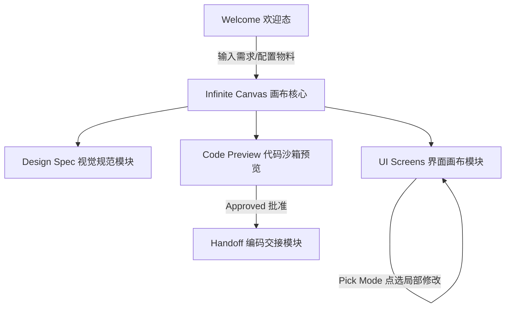

# Clutch — Design 模式产品功能与业务逻辑分析指南

本指南面向产品经理（PM）、设计师及业务团队，以业务语言全面梳理 Clutch 的 **Design 模式（设计模式）**的定位、核心功能模块、解决的痛点、用户使用流程及底层功能点。

---

## 1. 产品定位与核心价值

**Design 模式**是 Clutch 的核心双模架构之一（Coding 模式与 Design 模式）。
它的核心定位是一个**基于画布的高保真 UI/UX 智能生成与编排工作区**。它允许用户（如产品经理、交互设计师或前端开发者）以极低的门槛，通过自然语言和参考资料（图片、文档、网址），快速生成、修改和验证产品的界面原型与视觉规范，并一键导出为标准的生产级前端代码（React + Tailwind），与 Coding 模式的开发智能体无缝对接。

*   **与 Coding 模式的关系**：Design 模式专注于“界面与交互的视觉呈现”，不运行 CLI 开发工具链，而是直接调用 LLM 推理接口；当用户对界面外观和规范满意并“Approve（批准）”后，通过 Handoff（交接件）移交给 Coding 模式，由 CLI Agent 接着实现真实的后端 API 对接、复杂的业务逻辑与状态管理。

---

## 2. 解决的核心业务痛点

| 序号 | 业务痛点 | Design 模式解决方案 | 业务价值 |
| :--- | :--- | :--- | :--- |
| **1** | **设计与开发的割裂**<br>原型图到实际代码的开发还原度低，传统手写 React 和 Tailwind 样式耗时。 | **一键生成高保真代码**<br>AI 根据设计规范 and 要求，自动输出规范的 React 19 + Tailwind v4 组件代码，保证像素级还原。 | 极大缩短前端开发周期，减少沟通成本。 |
| **2** | **改动界面时的“牵一发动全身”**<br>用户想改个按钮颜色或新增一个输入框，传统的 AI 会重新重写整页，导致其他设计丢失。 | **局部的精准点选修改（Pick Mode）**<br>支持在预览画面中直接用鼠标点选某个具体的 HTML 元素，AI 会针对该元素（如特定按钮、表单项）进行就地修改。 | 实现“精准手术刀式”调整，保护已有的其他优秀设计不被破坏。 |
| **3** | **视觉系统缺乏一致性**<br>生成的界面色彩多杂、字体混乱，缺乏统一的品牌视觉（Design System）。 | **两阶段生成（规范 $\rightarrow$ 界面）**<br>生成界面前，先提炼或读取设计规范（Spec 卡），锁定调色板（Hex 颜色）、字体与核心组件库。生成的 UI 严格遵守该规范。 | 保证系列页面视觉风格的一致性，塑造专业、体面的品牌形象。 |
| **4** | **“黑盒”生成与不可预测性**<br>传统 AI 生成界面时，用户只能傻等，不知道中途发生了什么或生成到了哪一步。 | **无限交互画布（React Flow Canvas）**<br>以流程图的形式清晰呈现：*“输入 BRIEF $\rightarrow$ 提取规范 $\rightarrow$ 生成界面”*的来龙去脉。设计资产一目了然。 | 增强过程的透明度，方便直观比对、管理多个关联的屏幕（Screen）。 |
| **5** | **本地运行门槛高**<br>PM/设计生成 React 代码后无法方便地查看真实动态效果。 | **内置热预览沙箱**<br>后台自动拉起轻量级 Vite 服务器，提供实时预览 iframe，支持真实的浏览器交互。 | 无需配置任何本地开发环境，即做即看。 |

---

## 3. 核心功能模块划分



### 3.1. Welcome 欢迎态与物料配置模块
用户新建设计会话时的起点。提供极简的输入界面和丰富的附加物料入口，支持：
*   **设备规格切换**：一键切换 **Web 桌面端（1920×1080）** 或 **App 移动端（390×844）**，指导 AI 采用不同的布局策略（如 Web 端的侧栏/多栏网格布局，或 App 端的单列流式/底部导航布局）。
*   **多源物料上传（`+` 附件菜单）**：
    1.  **参考图（Image）**：支持拖拽、粘贴图片。Vision 模型会自动分析图片视觉结构、配色、间距。
    2.  **参考网址（URL）**：输入网站链接，后台 Sidecar 自动抓取该网页的 HTML 结构、标题、描述及摘要文本，提取其视觉风格。
    3.  **设计规范文档（`Design.md`）**：上传包含品牌主色调、规范的 Markdown 文档，锁定设计基调。

### 3.2. Infinite Canvas 交互式画布模块（React Flow）
由 React Flow 驱动的无限画布，将设计流程资产进行可视化节点管理。画布包含以下节点类型：
*   **Process 卡（处理节点）**：显示当前会话的 Prompt 摘要、工作进度（如 Generating、Thinking）以及详细的后台步骤日志。
*   **Source 卡（源物料节点）**：显示上传的图片缩略图、解析的网页快照、或 `DESIGN.md` 代码文本。
*   **Spec 卡（设计规范节点）**：可视化显示设计规范，包括调色板 HEX 色块、字体Aa示例字重、核心组件列表。
*   **UI Screen 卡（界面视图节点）**：
    *   以 iframe 形式嵌入生成的 HTML 页面，按设定设备（Web/Mobile）尺寸进行等比例缩小预览。
    *   卡片头部提供状态标识（Ready、Generating），并支持独立的“点选修改”操作。

### 3.3. Pick Mode 元素点选与局部精确修改模块
在 UI 预览图上实现组件级交互：
*   **智能 Hover 与选中样式**：开启后，鼠标滑过 UI 时，对应 DOM 元素会呈现虚线框，点击后锁定为蓝色实线框，并浮现当前组件的标签名（如 `button: 立即注册`、`input: 请输入手机号`）。
*   **路径捕获技术**：底层解析选中元素的 DOM 路径（IndexPath）和标签标识，发送修改指令时，将此定位数据附带在 prompt 尾部。
*   **局部精确迭代**：大模型接收到路径后，精准识别需要修改的组件区域（如“把这个输入框改成下拉框”），其余页面布局和结构保持不变。

### 3.4. Code Preview 代码生成与预览沙箱模块
从原型设计跨越到真实前端工程的枢纽。入口为 **Preview Demo** 工具栏 **Coding**（D39/D41，SSOT = `react/`）：

1.  **Approve Prototype（批准原型）**：视觉与连线定稿后，在 Coding 托盘点击 Approve。
2.  **Generate UI Code（确定性出码）**：将批准的 HTML **机械转为** 每屏 `.tsx`（禁止 LLM 重画）；同源 Tailwind CDN 主题；`interaction_contract.json` 写入 React Router `<Link>`。产物在会话目录 `react/`。
3.  **Preview（本地预览）**：启动 Vite；验收「代码跑起来 = 定稿样子 + 连线可用」。
4.  **Approve UI Code → Send to Coding**：前端 UI+导航已就绪，交接后主要接 API / 联调。

### 3.5. Handoff 开发交接模块
将设计成果移交给 Coding 模式（须先 Approve UI code）：
*   打包 `DESIGN.md` + `react/` 路径 + prompt 简报（强调接 API、勿重设计界面）。
*   点击 **Send to Coding** 切换回 Coding 模式并将 instruction 注入 Chat。
*   Coding Agent 在已导出页面上补齐业务逻辑与数据绑定。

---

## 4. 用户完整使用路径（User Journey）

```
1. 切换模式
   - 在顶部 Header 将模式切换为 "Design"

2. 设定目标与参考 (欢迎态)
   - 选择设备: Web 网页端 / App 手机端
   - 上传参考: 上传竞品截图, 填入参考网址, 或上传设计规范 .md 文件
   - 输入 Prompt: "设计一个在线音乐播放器的歌单与播放详情页" -> 点击发送

3. 视觉与版面设计 (画布互动)
   - AI 先生成 Spec (调色板、字体等颜色节点)
   - 画布上生成 UI Screen 节点 (支持通过 React Flow 放大、缩小、拖拽)
   - 体验不满意?
     - 方案 A: 在底部浮动输入框打字整体调整 ("把整体风格改得更具赛博朋克感")
     - 方案 B: 开启 Pick Mode (铅笔图标) -> 鼠标在 UI 上点选 "播放控制条" -> 底栏自动带上该组件标签 -> 输入 "把播放按钮改成金黄色，增大间距" -> 点击发送进行局部微调
     - 方案 C: 输入 "新建一个歌词展示页面" -> AI 在画布上新增一个 Screen 节点并自动绘制连线

4. 代码生成与实机测试 (Preview Demo → Coding，分步引导)
   - 可选：先在 Preview Demo 用 Connections 校对连线（契约落盘 interaction_contract.json）
   - Step 1 批准原型 → Step 2 确定性导出 React 页面（非 AI 重绘）→ Step 3 预览并批准 → Step 4 交给编码
   - Generate UI Code → 写入会话 react/（每屏 .tsx + 同源主题 + Link 导航）
   - Start Preview → 验收与定稿一致

5. 交接进入编码 (Handoff)
   - Step 4：Send to Coding（接 API / 联调，勿重设计界面）
   - 携带 DESIGN.md + react/ 路径跳转 Coding 模式 Chat
```

---

## 5. 详细功能点一览

1.  **设备视口等比收缩 (Viewports Scaling)**：
    *   Web 预览画布将 `1920×1080` 的真实尺寸按 `0.375` 倍率等比收缩渲染。
    *   Mobile 预览画布对 `390×844` 的尺寸进行展示。
2.  **Vite 服务端口防冲突管理**：
    *   使用动态空闲端口探测（`_free_port`），避免多会话预览冲突。
    *   预览服务器的进程生命周期由 FastAPI Sidecar 的 `_preview_procs` 线程锁安全控制，支持会话关闭时自动 `terminate()` 或 `kill()` 进程。
3.  **设计历史与缩略图持久化**：
    *   本地会话存档于 `.clutch/design/sessions/{Title}-{Device}__{RunId}` 下。
    *   会话侧边栏历史直接对已生成的 HTML 动态生成 SVG 缩略图/高保真预览，而非使用通用占位图。
4.  **快捷交互支持**：
    *   画布内支持 `⌘ + C` / `⌘ + V` (Ctrl + C/V) 快速复制和克隆 UI 节点页面，便于做 A/B Test。
    *   所有设计会话内的操作进度 and AI 思考日志均实时同步至后台 Terminal 面板中。
5.  **回退安全机制 (Visual Fail-safe)**：
    *   若 LLM 接口返回的 HTML 不符合标准、为空或没有可见内容，系统会自动切入预设的 Fallback HTML（如精心设计的默认登录页或主板），防止画布直接白屏崩溃。
