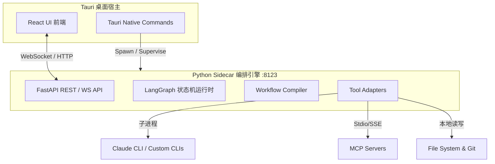

# Clutch — 本地 AI 多 Agent 编排与监督控制台

## 1. 产品定位与核心价值

**Clutch** 是一款面向独立开发者、技术运营人员以及 AI 工作流搭建者的桌面应用。它提供了一个 **可视化、零代码的 SOP（标准作业程序）工作流编排与运行控制台**。

通过 Clutch，用户可以像「导演」一样在画布上定义复杂的 Agent 工作流，由系统调度本地 AI 工具、MCP 服务及大语言模型（LLM）执行，并在统一的 IDE 级控制台中全程监督、人工审批和干预执行结果。

### 核心价值主张
- **零代码编排 (Zero-Code Orchestration)**：用户通过可视化拖拽连线即可定义 Agent 工作流，无需手写复杂的 Python / LangGraph 编排代码。
- **全流程监督 (Full Observability)**：打破 Agent 的“黑盒”状态，在 Chat 气泡、子进程终端日志、Git/文件 Diff、Flow 进度图以及工作区文件树中，实时暴露 Agent 的每一步思考与输出。
- **人机协同门控 (Human-in-the-Loop)**：在关键校验失败或敏感操作节点，图会自动挂起，由人类进行 Approve（批准强制通过）、Reject（打回原因）或 Retry（带补充指令重试）。
- **本地优先 (Local First)**：应用运行于本地（Tauri 壳 + Python Sidecar），敏感的 API Key 与工作区文件完全保留在用户本机，安全可控。

---

## 2. 系统架构概览

Clutch 采用 **前后端物理隔离、本地 loopback 通信** 的现代桌面端架构：



1. **前端 (Tauri + React 19 + Tailwind CSS 4)**：提供高保真三栏式工作台，负责渲染状态投影、画布编辑以及捕获用户输入。前端不承担任何业务逻辑，亦不直接读写磁盘。
2. **后端 (FastAPI + LangGraph Python Sidecar)**：服务于 `localhost:8123`，作为唯一的真理源 (SSOT) 控制状态跳跃。`WorkflowCompiler` 负责将 React Flow 导出的 JSON 动态编译成 LangGraph 可执行图。
3. **通信机制**：前后端通过 WebSocket 实时更新全局状态 `ClutchState`（采用 `state_patch` 增量推送）。

---

## 3. 核心功能特性

### 3.1 零代码工作流画布 (Flow Canvas)
- **节点类型**：
  - `start` (开始)：工作流虚拟入口。
  - `agent_task` (Agent 任务)：指定具体 Agent 角色（Orchestrator, Builder, Evaluator 等）、任务描述及绑定的 MCP 工具与本地命令行。
  - `check` (自动检查)：执行结构化校验（如文件存在校验、Shell 命令检测），作为 Evaluator 节点的运行依据。
  - `human_gate` (等我确认)：人机协同闸门，用于敏感或高风险操作。
  - `end` (完成)：工作流出口。
- **自动输入输出接力 (Handoff)**：当下游 Agent 节点激活时，系统自动解析输入链。如果直接上游为其他 Agent，则自动将上游的 `node_outputs` 注入到当前 Agent 的提示词中，支持链式 SOP 跑通（例如：天气调研官 Researcher -> 视觉艺术家 Artist 自动生图接力）。

### 3.2 三栏式运行监督控制台
- **左侧栏 (Navigation)**：管理工作区项目及分支（包含 Git 状态）、CRUD 运行会话历史。提供 Models Manager (模型管理)、MCP Server Hub 以及 Skills 扫描器的入口。
- **中间 Chat 流 (Chat Feed)**：
  - **角色渲染**：不同 Agent 气泡拥有区分样式（如 User、Orchestrator、Builder、Evaluator）。
  - **思考动效**：当 LLM 正在处理时，显示跳动的 Loader 和模型名称。
  - **人机交互卡片**：校验失败时实时呈现干预按钮（Approve / Reject / Retry）。
  - **物理 Stop 按钮**：支持一键物理终止正在运行的 Agent 任务或工作流（强杀子进程）。
- **右侧多功能面板 (Right Panel)**：
  - **Overview**：展示当前节点状态、执行进度和 Token 消耗。
  - **Files**：显示当前工作区文件树，支持未提交文件的点击预览。
  - **Flow**：以高亮形式动态显示当前工作流的活跃执行路径，并支持随时查看编译后的 Flow JSON。
  - **Changes**：通过 FS Watcher (磁盘监听) 和 Git status 实时汇总未提交的文件变更与 Diff 摘要。
  - **Terminal**：实时流式输出子进程的标准输出与错误（Stdout/Stderr），所有日志均由 Sidecar 自动进行幂等的时间戳格式化（如 `[2026-06-26 17:00:00 CST] [BUILDER] ...`）。

### 3.3 双引擎智能路由 (Double Engine Router)
在执行任务或普通 Plain Chat 对话时，系统根据配置自动分流：
1. **Claude Code CLI 引擎**：
   - 唤起本地 `claude -p` 子进程。
   - **Session 绑定机制 (ADR-020)**：持久化 session 并使用 `--resume <uuid>` 恢复会话，避免在多轮对话中重复发送全文历史，极大地降低了 Token 消耗和网络延迟。
2. **配置 LLM 引擎**：
   - 路由至用户自行配置的 API Provider (如 OpenAI, DeepSeek, 智谱 GLM 等)。
   - **Ollama 本地驱动**：系统可自动向本地 Ollama 服务发起探测 (`/api/tags`)，发现用户本地已下载的模型，并通过内置的代码能力和推理能力算法进行 **自动排序打分**，优先推荐最优秀的本地模型（如 `qwen3.6`），支持无 Key 极速本地部署。

### 3.4 虚拟 MCP 客户端与 Codex 文件补丁
- **虚拟 MCP 服务器 (`clutch-tools`)**：当 Agent 被授予本地文件系统（`local-fs`）访问权限时，系统自动挂载此虚拟服务器。
- **`apply_patch` 精密文件工具 (ADR-021)**：借鉴 OpenAI Codex 规范，为大模型提供物理文件操作支持（Add, Delete, Update, Move），免去了模型由于缺少删除 API 而采取的隐藏文件等 Workaround 方案。
- **高风险门控判定**：所有修改和删除文件的 Codex patch 动作均会在 Sidecar 的 `mcp_risk` 中触发安全判定，作为高危动作推送给 Supervisor 进行人工审批。

### 3.5 多语言 (i18n) 与凭证集成
- **彻底的双语化**：支持中英文（zh/en）界面一键切换。后端通过偏好设置 `tr(en, zh)` 动态翻译系统异常、WS 审批通知，并确保 pytest 测试套件在断言层面的兼容。
- **CC Switch 动态凭证导入**：启动时可自动扫描本地 `~/.cc-switch/cc-switch.db`，直接提取导入用户已录入的自定义 API Keys（如智谱、DeepSeek 等），无需用户在多处重复输入配置。

---

## 5. 内置 SOP 模板

Clutch 默认打包了常用 SOP 工作流模板（可在 `workflows/` 目录下找到）：

- **Video Production (视频生产)**：适用于流水线式的视频处理、文字稿生成、自动检查及人工审批发布。
- **Weather to Vision (天气插画接力)**：
  - **节点 1 (Researcher)**：天气情报官。负责分析输入天气调研要求，产出场景视觉描述。
  - **节点 2 (Artist)**：视觉艺术家。绑定 Agnes Image 生图引擎，将上游的视觉描述接力转化为一张高质量插画。
  - **节点 3 (End)**：流程结束。

---

## 6. 本地运行与构建指令

### 开发期启动 (Dev)
```bash
# 终端 1：启动 Python Sidecar (端口 8123)
cd services/orchestrator
uv run uvicorn src.main:app --reload --port 8123

# 终端 2：启动 Tauri 前端
cd apps/desktop
pnpm dev
```

### 本地轻量校验 (Pre-commit)
在提交代码前，必须跑通轻量校验（确保 Vite build 成功、Python pytest 测试通过、前后端 TS/Schema 机检漂移未发生）：
```bash
./scripts/verify.sh
```

### 全量 E2E 校验 (Push 前)
启动本地沙箱并执行完整 Tauri-Playwright GUI 自动化测试：
```bash
./scripts/verify.sh --e2e
```

### 桌面端打包 (Build DMG)
```bash
pnpm tauri build
```
打包成功后，生产版会自动内嵌 Sidecar Python runtime，双击生成的 `.dmg` 即可作为独立桌面客户端运行。

---

*本文档基于 M3-F09 阶段及 P2 增强会话的代码设计与手动 E2E 证据编写。最新架构详述见 [系统架构文档](file:///Users/fancy/clutch/docs/ARCHITECTURE.md)。*
