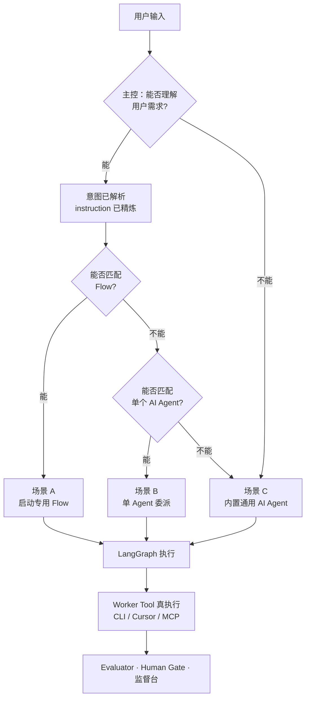
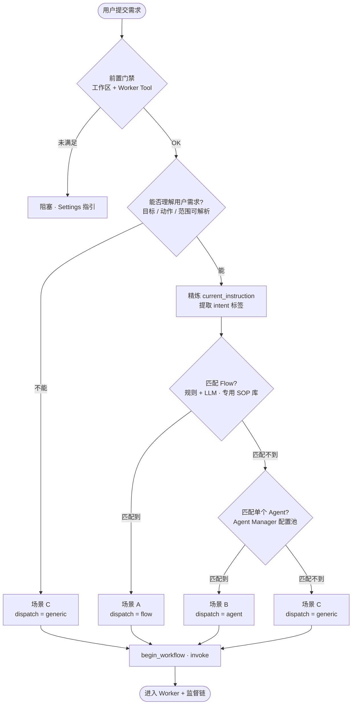
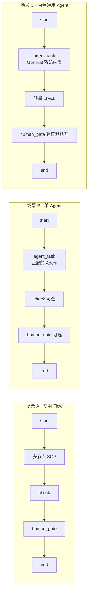
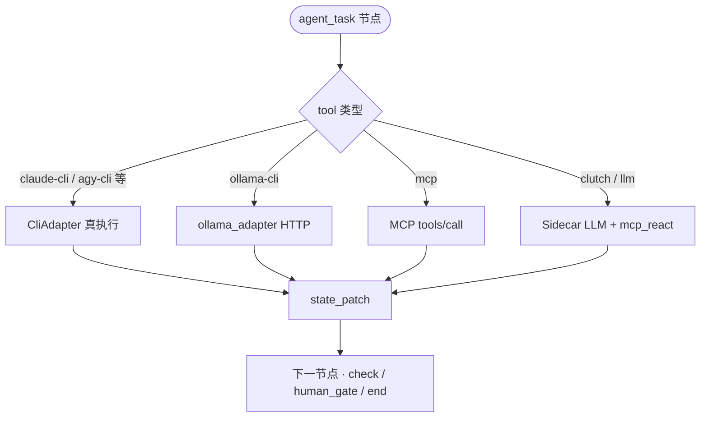
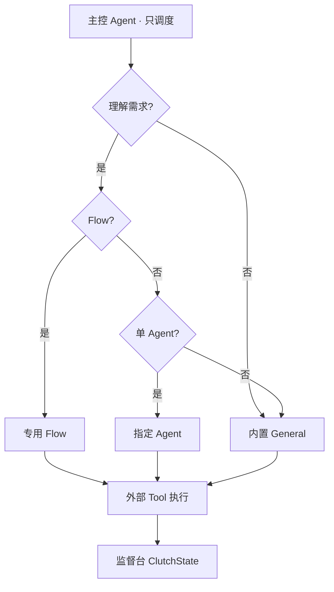
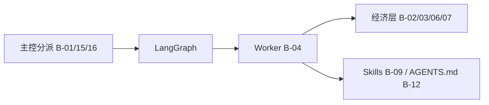

# Research Notice

Exploratory material only.

This document is **not** a source of truth.

Do **not** record implementation status or feature completion here.

Current implementation status:

- docs/PRODUCT_INTRO.md
- memory/ROADMAP.md
- docs/ARCHITECTURE.md

---

## 1. 调研范围与结论摘要

### 1.1 问题

Clutch Orchestrator 当前是 LangGraph **图路由节点**（边优先 + 极简 LLM 分支兜底），`agent_task` 多为单次 LLM chat，缺少优秀开源 Agent 工具在以下方面的成熟做法：

- 意图分解与计划
- Prefix cache / context 经济学
- Tool-use 执行闭环
- 子 Agent 与并行隔离
- 真实成本可观测

### 1.2 结论（一句话）

**自建轻量主控 Dispatcher**（理解需求、匹配 Flow/Agent、精炼指令），**不**复刻 Reasonix 式长会话 coding loop；执行交给工作流内 Worker + 外部 Tool。匹配不上专用 Flow 时 **先匹配单个 Agent，再降级内置 General**；**不让人选 Flow**。Token/compaction 等见 BACKLOG P1/P2，非主控刚需。

### 1.3 与 BACKLOG 的映射

| 调研主题 | BACKLOG ID |
|----------|------------|
| 理解需求 + 匹配 Flow | B-01 |
| 无 Flow → 匹配单 Agent | B-16 |
| 内置通用 Agent fallback | B-15 |
| Worker 真 Tool 执行 | B-04 |
| 真实 token + cache | B-02 |
| Context compaction | B-03 |
| 图内路由（读校验结果） | B-05 |
| Planner/Executor 双 session | B-06 |
| Auto 模型路由 | B-07 |
| 子 Agent + worktree | B-08 |
| Skills 动态注入 | B-09 |
| 跨 run 检索 | B-10 |
| Workspace 回滚 | B-11 |
| 项目 AGENTS.md | B-12 |
| LSP 反馈闭环 | B-13 |
| Cache-safe fork | B-14 |

---

## 2. Clutch 基线（调研时快照）

### 2.1 Orchestrator 实际行为

- **路由：** `services/orchestrator/src/orchestrator/routing.py` — 工作流 `edge.when` 优先；无信号时 LLM 仅返回分支 key（`passed`/`failed` 等）。
- **LLM 兜底 prompt：** 仅含 `source`、 `state.keys()`、分支选项列表（`llm/router.py` `as_route_suggester`）。
- **agent_task：** `agent_executor.py` 单次 `router.chat`，无 tool loop；输出为「将做什么」的描述性文本。
- **Evaluator：** `file_exists` / `shell` / `lint`（`evaluator.py`）；无 LSP 诊断回灌。
- **Token：** `main.py` 字符估算 + 固定单价，无 API `usage`、无 cache 字段。
- **监督：** LangGraph `interrupt_before` + Human Gate（Clutch 优势）。

### 2.2 已立项、不在本调研升格范围

- P2-01 Skills Registry（进行中/已完成）
- P2-02～P2-06 MCP、Theme、i18n、侧栏、Settings

---

## 3. 参考项目一览

### 3.1 终端 Coding Agent

| 项目 | 仓库 / 主页 | Stars（约） | 语言 | 定位 |
|------|-------------|------------|------|------|
| **DeepSeek Reasonix** | [esengine/DeepSeek-Reasonix](https://github.com/esengine/DeepSeek-Reasonix) | 24k+ | Go | Prefix-cache-first harness；配置 + MCP 插件 |
| **DeepSeek TUI** | [Hmbown/DeepSeek-TUI](https://github.com/Hmbown/DeepSeek-TUI) | 38k+ | Rust | DeepSeek V4 终端 Agent；RLM、LSP、三模式 |
| **OpenCode** | [opencode.ai](https://opencode.ai/) / [sst/opencode](https://github.com/sst/opencode) | 160k+ | — | 终端 + 桌面 + IDE；75+ Provider；Build/Plan |
| **Aider** | [Aider-AI/aider](https://github.com/Aider-AI/aider) | 44k+ | Python | Git 原生 pair programming；repo map |
| **Goose** | [aaif-goose/goose](https://github.com/aaif-goose/goose) | 45k+ | Rust | Recipe 驱动 SOP；MCP；AAIF 治理 |
| **Crush** | [charmbracelet/crush](https://github.com/charmbracelet/crush) | — | Go | 原 `opencode-ai/opencode` 后继（Charm） |

> 注：GitHub `opencode-ai/opencode` 已归档迁 Crush；高 star 的 OpenCode 指 opencode.ai 生态。

### 3.2 IDE / 平台型

| 项目 | 仓库 | Stars（约） | 与 Clutch 关系 |
|------|------|------------|----------------|
| **Cline** | [cline/cline](https://github.com/cline/cline) | 61k+ | Plan/Act + MCP；最接近 Human Gate 体验 |
| **OpenHands** | [OpenHands/OpenHands](https://github.com/OpenHands/OpenHands) | 78k+ | 沙箱 + Agent Canvas；ACP 接外部 Agent |
| **Continue** | [continuedev/continue](https://github.com/continuedev/continue) | 33k+ | IDE assistant，偏补全而非编排 |

### 3.3 编排层（与 Clutch 定位最近邻）

| 项目 | 说明 |
|------|------|
| **[Stoneforge](https://stoneforge.ai/)** | 调度 Claude Code / OpenCode / Codex；git worktree 隔离；任务依赖与合并队列 |
| **[langgraph-supervisor](https://github.com/langchain-ai/langgraph-supervisor-py)** | LangGraph 官方 Supervisor；现推荐 tool-based handoff 而非仅依赖此库 |
| **[agentcache](https://github.com/masteragentcoder/agentcache)** | Cache-aware 多 Agent fork；microcompaction；cache-break 检测 |

### 3.4 架构文献（非产品）

- [AgentPatterns — Prompt Caching](https://agentpatterns.ai/context-engineering/prompt-caching-architectural-discipline/)
- [Zylos — Prompt Caching for AI Agents](https://zylos.ai/research/2026-02-24-prompt-caching-ai-agents-architecture)
- LangGraph Supervisor 实践（supervisor-workers 模式）

---

## 4. 分项目要点

### 4.1 DeepSeek Reasonix

**卖点：** 围绕 DeepSeek prefix cache 的长会话成本优化。

| 机制 | 说明 |
|------|------|
| Prepend-only session | 会话前缀稳定，利于 cache hit |
| Coordinator（双模型） | Planner 与 Executor **独立 session**，避免混对话破坏 prefix |
| Compaction（§3.6） | `prompt_tokens` 达 context_window × 0.8 时折叠 assistant/tool 轮次；用户短消息与 digest 保留；原文归档 JSONL |
| 按需检索 | `history`（BM25）、`memory`（项目记忆）工具 |
| Plan / Goal | Plan 模式只读探索；`/goal` + AutoResearch 本地状态目录 |
| Permission | `Bash(cmd:*)`、`Edit(path/**)` 细粒度规则 |
| 插件 | MCP stdio/HTTP；内置工具编译期注册 |

**文档：** [REASONIX.md](https://github.com/esengine/DeepSeek-Reasonix/blob/main-v2/REASONIX.md)、[docs/SPEC.md](https://github.com/esengine/DeepSeek-Reasonix/blob/main-v2/docs/SPEC.md)

### 4.2 DeepSeek TUI

**卖点：** 终端原生完整 agent loop + DeepSeek V4 特性。

| 机制 | 说明 |
|------|------|
| 三模式 | Plan（只读 + checklist）、Agent（审批）、YOLO（全自动） |
| `--model auto` | flash 轻量路由 → 选 pro/flash + thinking off/high/max |
| RLM | `rlm_query`：大输入 fan-out 给便宜 flash 子调用 |
| LSP | 编辑后注入 diagnostics（rust-analyzer、pyright 等） |
| 成本 | 每轮 token + **cache hit/miss** 分解 |
| 子 Agent | 后台任务 + 进度；父 Agent 消化结果 |
| Skills | `load_skill` 按任务描述自动选用 |
| 安全网 | side-git 快照 `/restore`；持久化 task queue |

**仓库：** [Hmbown/DeepSeek-TUI](https://github.com/Hmbown/DeepSeek-TUI)

### 4.3 OpenCode

- Build / Plan 双 Agent 模式；多 session 并行。
- **autoCompact：** 用量达 context 约 95% 时自动摘要新 session。
- LSP、文件变更跟踪、75+ Provider。

### 4.4 Goose

- **Recipe：** YAML/JSON — 指令 + 参数（Jinja2）+ 工具 + 子 Recipe；与 Clutch Workflow JSON **结构最接近**。
- `goose run --recipe`、cron 调度、GitHub Recipe 源。
- Goosehints 项目级指令；70+ MCP extensions。

### 4.5 Cline

- **Plan → 用户审 → Act** 闭环；编辑器内多步 tool use。
- MCP Marketplace；与 Clutch「监督而非黑盒」产品语言一致。

### 4.6 OpenHands

- Docker 沙箱；任务描述 → PR 级自主交付。
- **Agent Canvas：** 多 Agent 控制面；ACP 接 Claude Code / Codex。
- 与 Clutch「调度本地 CLI / Cursor」路线同向。

### 4.7 Stoneforge

- **不自己写代码**，只编排已有 Agent。
- git worktree 隔离并行任务；依赖图 + 合并队列。
- Clutch 若做 B-08，Stoneforge 是直接参照。

### 4.8 agentcache

- Prefix-preserving fork；并行 worker。
- Microcompaction：清理陈旧 tool 结果、旧 thinking block，保持 cache 对齐。
- Cache-break 检测与遥测。

---

## 5. 能力对比矩阵

| 维度 | Reasonix | DeepSeek TUI | OpenCode | Goose | Cline | OpenHands | Stoneforge | **Clutch** |
|------|----------|--------------|----------|-------|-------|-----------|------------|------------|
| Prefix cache 设计 | ★★★ | ★★☆ | ★★☆ | ★☆☆ | ★☆☆ | ★☆☆ | ★☆☆ | ☆☆☆ |
| Context compaction | ★★★ | ★★☆ | ★★☆ | ★☆☆ | ★☆☆ | ★★☆ | — | ☆☆☆ |
| 意图分解 / Plan | ★★☆ | ★★★ | ★★☆ | ★★☆ | ★★★ | ★★☆ | ★☆☆ | ☆☆☆ |
| Tool-use loop | ★★★ | ★★★ | ★★★ | ★★★ | ★★★ | ★★★ | — | ☆☆☆ |
| 子 Agent / 并行 | ★★☆ | ★★★ | ★★☆ | ★★☆ | ★☆☆ | ★★★ | ★★★ | ☆☆☆ |
| 可视化 SOP 工作流 | — | — | — | ★★☆ | — | ★☆☆ | ★★☆ | ★★★ |
| Human Gate / 审批 | ★★☆ | ★★★ | ★★☆ | ★★☆ | ★★★ | ★★☆ | ★☆☆ | ★★★ |
| MCP / Skills | ★★★ | ★★★ | ★★☆ | ★★★ | ★★★ | ★★★ | — | ★★☆（P2） |
| 真实 token / cache 计量 | ★★☆ | ★★★ | ★★☆ | ★☆☆ | ★☆☆ | ★★☆ | — | ☆☆☆ |
| 调度外部 CLI Agent | — | ACP | — | — | — | ACP | ★★★ | ★★☆（M3） |

（★ 为相对成熟度，非精确评分。）

---

## 6. Clutch 缺口与借鉴来源

### 6.1 按 BACKLOG 优先级

**P0 — 主控分派 + Worker 真执行**

| ID | 缺口 | 首选借鉴 |
|----|------|----------|
| B-01 | 理解需求 + 匹配 Flow + 精炼 `current_instruction` | Goose Recipe、LangGraph Supervisor |
| B-16 | 无 Flow → 匹配 Agent Manager 内单 Agent | Goose Recipe 参数化 Agent |
| B-15 | 不理解 / 双不匹配 → `general-fallback` + 系统 General | 内置模板（D5）、D10 边界 |
| B-04 | `agent_task` 按 tool 分流真执行 | M3 CLI Adapter、ARCHITECTURE §6.4 |

**P1 — Token 经济学 + 路由智能**

| ID | 缺口 | 首选借鉴 |
|----|------|----------|
| B-02 | 字符估算 → API usage + cache 字段 | TUI cache telemetry、Reasonix `prompt_tokens` |
| B-03 | 长会话 messages 压缩 + 归档 | Reasonix §3.6、OpenCode autoCompact |
| B-05 | 路由 LLM 读 `validation_errors`、日志 | LangGraph Supervisor prompt 模式 |
| B-06 | Planner flash 只读 / Executor pro 写 | Reasonix Coordinator |

**P2 — 增强执行与扩展**

| ID | 缺口 | 首选借鉴 |
|----|------|----------|
| B-07 | 按任务复杂度选模型 | TUI `--model auto` |
| B-08 | 并行子任务隔离 | Stoneforge worktree、TUI RLM |
| B-09 | Skills 片段注入 | TUI `load_skill`（P2-01 完成后） |
| B-12 | `.clutch/AGENTS.md` | Reasonix `/init`、Goosehints |
| B-13 | LSP → Builder 反馈 | TUI、OpenCode LSP |
| B-14 | Fan-out 不破坏 prefix | agentcache |

**P3 — 长期体验**

| ID | 缺口 | 首选借鉴 |
|----|------|----------|
| B-10 | 历史 run BM25 检索 | Reasonix `history` tool |
| B-11 | reject 后工作区回滚 | TUI side-git `/restore` |

### 6.2 Clutch 应保留的差异化

- 零代码 Workflow JSON + LangGraph 编译（非单 Agent 黑盒）
- React 监督台投影 `ClutchState`（非纯 TUI）
- Human Gate 作为一等公民（优于 YOLO 默认）
- 多角色 SOP（Builder / Evaluator / Supervisor）显式可见

---

## 7. 主控分派架构（产品共识 · 未立项）

> 权威索引：[`memory/BACKLOG.md`](../../memory/BACKLOG.md) §主控分派策略。  
> 与 **D10**（不做 Single Agent 模式 UI）不冲突：B/C 为系统自动 fallback。

### 7.1 三种终态

| 场景 | 条件 | 终态 | `dispatch_kind` |
|------|------|------|-----------------|
| **A** | 能理解需求 + 匹配到 Flow | 专用 Flow | `flow` |
| **B** | 能理解需求 + 无 Flow + 匹配到单 Agent | 指定 Agent + 迷你流 | `agent` |
| **C** | 不能理解需求；或能理解但 Flow、单 Agent 均无匹配 | 内置通用 Agent | `generic` |

**不让人选 Flow / Agent**；Chat 可选一句说明（如「已匹配 SOP：xxx」/「使用 General Agent」）。

### 7.2 总览



### 7.3 主控分派（完整）



`generic_reason` 建议区分：`unintelligible`（不理解）与 `no_flow_no_agent`（理解但无匹配）。

### 7.4 三种场景的执行形态



| 场景 | workflow 来源 | Agent 来源 |
|------|---------------|------------|
| A | 匹配到的用户/模板 Flow | 图内各节点配置 |
| B | 内置 `single-agent-run.json`（参数化） | Agent Manager **匹配到的那一个** |
| C | 内置 `general-fallback.json`（只读） | 系统 **General** |

### 7.5 Worker 执行（主控退出后）



图内 **条件边路由**（`passed`/`failed`）仍走 `routing.py`（B-05 可增强输入）；与 **start 分派**（B-01/B-16/B-15）职责分离。

### 7.6 建议 `dispatch` 载荷（实现时）

```text
dispatch_kind:   "flow" | "agent" | "generic"
workflow_id:     string
agent_id:        string | null    # B/C 为匹配 id；C 为 "general"
instruction:     string           # 精炼后任务
generic_reason:  "unintelligible" | "no_flow_no_agent" | null
reason:          string | null    # UI 可选一句说明
```

### 7.7 角色边界



主控 **不做**：读改代码、长会话 tool loop、让人选 Flow、compaction/RLM（见 BACKLOG P1/P2）。

### 7.8 可选后续层（非主控刚需）



---

## 8. LangGraph Supervisor 官方态度（2026）

[langgraph-supervisor-py](https://github.com/langchain-ai/langgraph-supervisor-py) README 指出：多数场景更推荐 **supervisor 通过 tools handoff** 到 specialist，而非仅依赖库内封装。Clutch 已用 **预定义 Workflow 图 + 条件边**，控制力强于黑盒 Supervisor；缺口在 **Orchestrator 节点的 LLM 输入质量**（应读完整 `ClutchState` 摘要，而非 `state.keys()`）。

---

## 9. 预留任务 ID（升格时用）

| 预留 ID | 对应 BACKLOG | 说明 |
|---------|--------------|------|
| P2-07 | B-01 | 主控：理解需求 + 匹配 Flow + 精炼 instruction |
| P2-12 | B-16 | 无 Flow → 匹配单 Agent + `single-agent-run` |
| P2-13 | B-15 | 内置 General + `general-fallback.json` |
| P2-10 | B-04 | `agent_task` 按 tool 真执行 |
| P2-08 | B-02 | 真实 token + cache 字段 |
| P2-09 | B-03 | Messages compaction |
| P2-11 | B-05 | 图内路由 LLM 读校验结果 |

编号在写入 `tasks.md` 前仅为备忘，不与已承诺 P2-02～06 冲突。

---

## 10. 参考资料

| 资源 | URL |
|------|-----|
| DeepSeek Reasonix | https://github.com/esengine/DeepSeek-Reasonix |
| DeepSeek TUI | https://github.com/Hmbown/DeepSeek-TUI |
| OpenCode | https://opencode.ai/ |
| Goose | https://github.com/aaif-goose/goose |
| Cline | https://github.com/cline/cline |
| OpenHands | https://github.com/OpenHands/OpenHands |
| Aider | https://github.com/Aider-AI/aider |
| langgraph-supervisor | https://github.com/langchain-ai/langgraph-supervisor-py |
| agentcache | https://github.com/masteragentcoder/agentcache |
| Stoneforge | https://stoneforge.ai/ |
| Clutch ARCHITECTURE §6.1 | [`docs/ARCHITECTURE.md`](../ARCHITECTURE.md) |
| Clutch BACKLOG | [`memory/BACKLOG.md`](../../memory/BACKLOG.md) |

---

*本文档随调研深化可追加章节；立项项以 `DECISIONS.md` + `tasks.md` 为准。*
