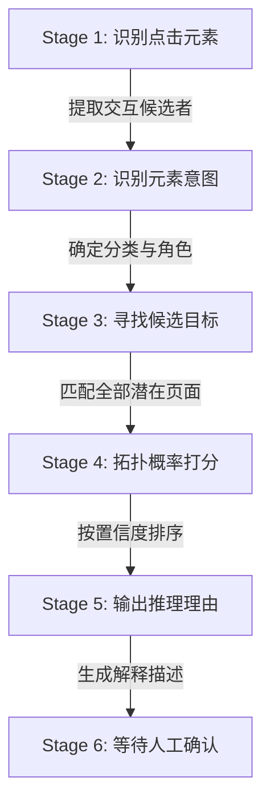
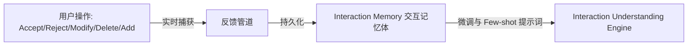
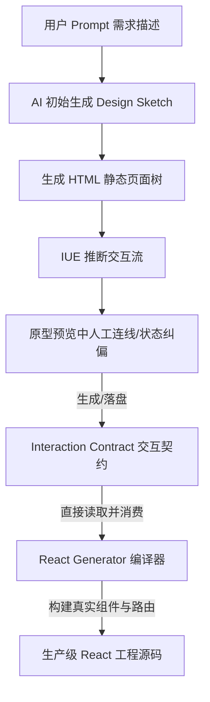

# 一键生成可点击交互原型与交互契约引擎需求规格说明书 (PRD)

## 1. 核心产品目标 (Product Objectives)

传统原型工具往往是一次性预览资产，而在 Clutch 零代码多 Agent 平台中，原型是连接“设计意图”与“代码编译”的中央轴心。本引擎旨在解决不可控静态页面（Unstructured UI）的交互连接问题，达成以下三个核心产品目标：

*   **目标一：AI 自动串联 (AI-Driven Prototyping)**
    让 AI 自动分析并把生成的静态页面无缝串联为高保真的可点击交互原型。
*   **目标二：极低纠偏成本 (Human-in-the-Loop)**
    AI 难免有推断偏差，系统应提供简便的可视化界面，允许用户**仅针对 AI 猜错的部分**进行单点拉线和行为修改，省去繁琐的全量配置工作。
*   **目标三：编译契约化 (Source of Truth)**
    生成的原型拓扑关系将直接以结构化文件落盘，成为最终多端（React、Vue、SwiftUI 等）生产代码生成的**唯一交互契约（Interaction Contract）**，使 AI 代码生成引擎摆脱“逻辑盲猜”窘境。

---

## 1.5 落地实施原则 (Implementation Principles)

为了保障该系统在 Clutch 中的顺利落地与高质量演进，技术研发与迭代必须遵循以下三大实施原则：

1. **优先保障完整 Pipeline 跑通 (Pipeline Integrity First)**
   设计与开发过程中，优先保证“从静态 HTML -> 意图识别匹配 -> 生成契约配置 -> 原型运行时拦截 -> 代码生成编译器消费”的完整闭环管道跑通与验证。不追求一次性实现所有高级能力（如极复杂的复合条件与多权限路由拦截），通过迭代逐步强化各局部节点的智能度和业务模拟密度。
2. **模块与引擎高内聚、可插拔 (Decoupled & Plug-and-Play)**
   所有推断、渲染、持久化与编译模块（例如：IUE 中的向量打分或大模型接口、运行时中的特定样式注入、编译器中的 UI 库转换等）均采用高度松耦合、可插拔接口设计。允许未来在不改动和不影响已定义好的 `Interaction Contract` 核心协议的前提下，替换或升级其内部的具体技术实现方式。
3. **单一事实源原则 (Single Source of Truth)**
   **`Interaction Contract` 是唯一的交互意图事实真相源。** 无论是原型仿真运行时 (Prototype Runtime) 还是代码生成编译器 (Code Generator)，都必须强制统一读取和消费同一份契约配置文件的输出，**严禁**为原型和生成源码分别维护两套跳转或呈现逻辑，确保所见即所生成的绝对确定性。

---

## 2. 交互理解引擎管道流 (Interaction Understanding Engine)

为规避与特定 LLM 绑定的局限性，我们将第二阶段升级为模块化的 **Interaction Understanding Engine (IUE)**。该引擎支持插拔式引入规则过滤、向量检索（Embedding）、视觉模型（Vision）、图算法（Graph）以及智能体（Agent）等推断源。

IUE 内部推断过程细分为以下六个原子阶段（Stage）：



### Stage 1: 识别点击元素 (Interactive Candidate Identification)
*   **输入**：脱水降噪后的 DOM 树（已过滤冗余包裹容器、已将内联 `<svg>` 替换为 `[ICON_SVG]` 占位符）。
*   **动作**：提取所有潜在可交互节点。

### Stage 2: 识别元素意图 (Intent/Role Classification)
*   **输入**：候选节点。
*   **动作**：分析节点文本、相邻元素及语义位置，确定该节点的角色（例如：`SubmitButton`、`CancelButton`、`TableRowLink`、`PaginationNext` 等）。

### Stage 3: 寻找候选目标 (Target Matching)
*   **输入**：交互意图节点。
*   **动作**：扫描当前会话所有的可用 Screen 列表，通过字符串编辑距离、关联度向量等手段，寻找潜在的跳转目标候选集。

### Stage 4: 拓扑概率打分 (Confidence Ranking)
*   **输入**：候选目标集。
*   **动作**：结合全局上下文特征，为每个跳转选项打分（0.0 ~ 1.0 置信度）。

### Stage 5: 输出推理理由 (Explainability)
*   **输入**：最高打分的跳转路线。
*   **动作**：生成清晰易读的中文推断理由（例如：“表格行点击，通常跳转至同名详情页”），以便用户审查。

### Stage 6: 等待人工确认 (Human Approval Gate)
*   **输入**：推断结果契约草稿。
*   **动作**：以临时虚线形态渲染在编辑器画布中，阻断至代码生成器，等待用户一键通过或调整。

---

## 3. 用户反馈闭环与交互记忆体 (Feedback Loop & Interaction Memory)

为了让原型引擎越用越聪明，建立反馈机制将用户的所有编辑行为实时回流：



### 1. 用户操作类型归档：
*   **Accept (接受)**：用户点击虚线建议，将其转为实线。此动作增强该匹配路径在 IUE 中的权重。
*   **Reject (拒绝)**：用户断开虚线建议。IUE 应记住此错误配对，避免后续轮次再次生成。
*   **Modify (修改)**：用户双击连线，修改其触发条件或展现模式（如由“页面跳转”改为“抽屉显示”）。
*   **Delete (删除)**：用户删除某条交互关系。
*   **Add (手动新增)**：用户手动连接两个节点。这通常属于深度业务定制流，为 IUE 提供了最宝贵的领域特有交互逻辑。

### 2. 交互记忆体 (Interaction Memory)
*   回流的数据会被打上**“产品领域指纹”**落盘。
*   下一次为该产品生成新页面或迭代原型时，IUE 优先检索交互记忆体中的关联，实现“越用越懂你的产品”的自我演进能力。

---

## 4. 交互契约定义规格书 (Interaction Contract Schema)

跳转关系配置文件将由低维度的 `routes.json` 全面升级为跨平台兼容的 **Interaction Contract (交互契约)** 规范。此契约能够被 React、Vue、Flutter 甚至 iOS SwiftUI 代码生成器无缝消费，彻底消除代码生成阶段的盲目推测。

### Schema 数据模型定义 (TypeScript 描述)
```typescript
interface InteractionContract {
  // 全局契约版本
  version: string;
  // 拓扑映射表
  interactions: Record<string, TriggerInteraction>;
}

interface TriggerInteraction {
  // 触发行为，默认 "click"
  trigger: "click" | "hover" | "doubleClick" | "drag" | "change";
  
  // 目标画板 ID 或组件名称
  target: string;
  
  // 原型跳转的呈现模式
  presentation: "page" | "overlay" | "popover";
  
  // 补间过渡动画类型
  animation: "slide" | "fade" | "scale" | "none";
  
  // 执行这步交互的前置业务条件 (例如: 表单校验通过且支付未成功)
  condition?: string;
  
  // 访问权限控制契约
  permission?: "guest" | "user" | "admin" | string;
  
  // 是否在空闲时预加载目标页面内容
  prefetch: boolean;
  
  // 参数与上下文状态传递 (支持表达式)
  params?: Record<string, string>;
  
  // 弹出层/浮窗的规格细节配置
  overlay?: {
    style: "drawer" | "modal" | "dialog" | "sheet" | "alert" | string;
    position?: "left" | "right" | "center" | "floating";
    width?: string;
    height?: string;
    backdropBlur?: boolean;
    closeOnBackdropClick?: boolean;
  };
}
```

### 生产级 JSON 示例文件
```json
{
  "version": "1.0.0",
  "interactions": {
    "btn-user-add-882": {
      "trigger": "click",
      "target": "UserCreateForm",
      "presentation": "overlay",
      "animation": "slide",
      "prefetch": true,
      "permission": "admin",
      "params": {
        "groupId": "currentGroup.id",
        "role": "'operator'"
      },
      "overlay": {
        "style": "drawer",
        "position": "right",
        "width": "400px",
        "backdropBlur": true
      }
    }
  }
}
```

---

## 5. 原型沙箱运行时 (Prototype Runtime)

为了承载复杂高密度仪表盘原型的仿真度，预览端集成一个轻量级 **Prototype Runtime**，作为底层沙箱框架运行在 iframe 宿主环境或 Portal 中。

该运行时不限制具体类或模块结构，但必须提供以下核心运行能力：
1. **导航与历史管理 (Navigation & History)**：模拟前进、后退、路由栈以及多画板切换生命周期，确保预览导航不影响宿主浏览器历史。
2. **弹出层/覆盖态管理 (Overlay Context)**：支持多层弹出层（如在 Drawer 上级再触发二次确认 Dialog）的遮罩堆叠、关闭和动画事件派发。
3. **全局状态机 (Global State/Context)**：支持跨画板的参数传递与局部上下文占存，供后续页面组件读取并响应对应数据。
4. **模拟网络与数据拦截 (Mocking & Interception)**：拦截页面网络请求与 API 调用，动态返回满足原型展示所需的 mock 数据；支持模拟加载延时与失败流（Shimmer 骨架屏触发）。
5. **偏好与权限治理 (Governance)**：支持角色权限、明暗主题和国际化多语言文本在原型运行时的全局切换和局部过滤。

---

## 6. 多维业务状态流与场景模拟 (Scenario Groups)

原型的核心价值不仅在于页面跳转，更在于对**复杂业务状态流转**的逼真模拟。本引擎支持在侧边栏一键切换“全局业务状态”与“连续场景组 (Scenarios)”：

### 1. 原子业务状态 (Atomic Business States)
原型应支持对目标画板一键施加如下基础业务态，运行时将根据状态类型自动触发 DOM 结构变更：
*   `Normal` (正常)
*   `Empty` (空数据态：组件内容替换为占位图)
*   `Loading` (加载中骨架屏)
*   `PermissionDenied` (无权限展示)
*   `Expired` (会话已过期)
*   `NoData` (搜索无结果)
*   `NetworkError` (网络异常横幅)
*   `Offline` (离线脱机提示)
*   `Success / Partial Success` (操作成功/部分成功状态控制)

### 2. 场景流推进 (Scenario Groups)
允许用户将一连串状态封装为一个“连续的场景剧情”（如：订单退款流程）：
*   **状态 A**：用户点击“申请退款”按钮 -> 弹出 Modal（状态：退款确认中）。
*   **状态 B**：点击 Modal 确认 -> 页面跳转至详情页，头部横幅切换为（状态：退款审核中）。
*   **状态 C**：点击“加速审核”按钮 -> 状态秒切为（状态：退款成功）。
预览控制栏提供“场景播放器”，用户可步进式切换这组剧情，向业务客户完美演示状态机跃迁。

---

## 7. Pipeline 唯一真相：编译级代码转化 (React Compiler Contract)

这是本引擎在整个 AI Coding 闭环中最核心的定位。**原型预览绝非一次性玩具，而是 AI 生成最终 React/Vue 代码的物理唯一真相源 (Source of Truth)**。



### 编译契约化交付流程
1.  **AI 不再盲猜代码结构**：
    React 代码生成器（React Generator）在解析 HTML 模板准备将其组件化时，**首要步骤是读取 `Interaction Contract`**。
2.  **绝对无损的结构转化**：
    *   如果契约声明 `btn-user-add` 对应 `presentation: "overlay", overlay: { style: "drawer" }, target: "UserCreateForm"`，React 编译器会自动引入组件 `import { Sheet } from '@/components/ui/sheet'`，并自动将页面源码转换为：
        ```tsx
        <Sheet>
          <SheetTrigger asChild>
            <button id="btn-user-add">添加用户</button>
          </SheetTrigger>
          <SheetContent>
            <UserCreateForm />
          </SheetContent>
        </Sheet>
        ```
    *   完全替代了大模型依靠猜测在代码里胡乱组装 Modal 或手动编写复杂 state 的低效模式。
3.  **零偏差交付保证**：
    由于编译引擎和预览运行时都服从同一份 `Interaction Contract`，这彻底保证了：**你在交互原型中调整好、确认过的一切跳转、弹窗效果，就是你最终导出的工程代码效果！**
